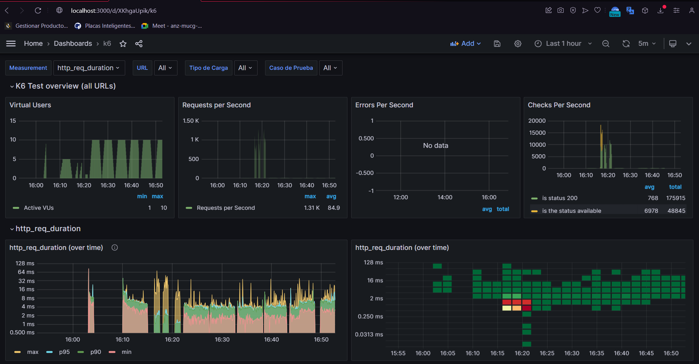

# QAATChallenge

## Pruebas de Rendimiento de APIs de Petstore
En la segunda parte del desafío técnico, el enfoque esta realizar pruebas de rendimiento exhaustivas a las APIs ofrecidas por Petstore de Swagger. El propósito principal de estas pruebas fue evaluar de manera efectiva cómo se comportan dichas APIs bajo distintas condiciones de carga, identificando así posibles problemas de rendimiento que podrían afectar la experiencia del usuario o la funcionalidad de las APIs.

### Metodología de Pruebas
Se desarrollaron scripts de pruebas utilizando herramientas modernas que nos permitieron simular varios escenarios de usuario.
Estos scripts fueron diseñados para medir el rendimiento de las APIs bajo tres condiciones específicas: carga ligera, carga constante y carga de pico. Cada uno de estos escenarios representa un patrón de uso particular del sistema.

### Cobertura de Casos de Prueba
Dada la libertad de análisis para determinar la cobertura de casos de prueba más relevantes e impactantes. Se priorizó un conjunto de operaciones críticas para el negocio y la experiencia del usuario, incluyendo la creación, actualización, consulta y eliminación de recursos de mascotas, usuarios y pedidos de tienda.

## Tecnologías Utilizadas
- JavaScript
- Docker
- K6
- Grafana
- InfluxDB

## Tabla de Casos de Prueba

| Módulo | Operación                       | Carga Ligera (VUs) | Carga Constante (VUs) | Carga de Pico (VUs) |
|--------|---------------------------------|---------------------|------------------------|---------------------|
| Pet    | `POST /pet`                     | 10                  | 20                     | 40                  |
| Pet    | `PUT /pet`                      | 10                  | 20                     | 40                  |
| Pet    | `GET /pet/findByStatus`         | 10                  | 20                     | 40                  |
| Pet    | `GET /pet/{petId}`              | 10                  | 20                     | 40                  |
| Pet    | `DELETE /pet/{petId}`           | 10                  | 20                     | 40                  |
| User   | `POST /user`                    | 10                  | 20                     | 40                  |
| User   | `PUT /user/{username}`          | 10                  | 20                     | 40                  |
| Store  | `POST /store/order`             | 10                  | 20                     | 40                  |
| Store  | `GET /store/order/{orderId}`    | 10                  | 20                     | 40                  |
| Store  | `DELETE /store/order/{orderId}` | 10                  | 20                     | 40                  |
| Store  | `GET /store/inventory`          | 10                  | 20                     | 40                  |


## Estructura del Código

El código está diseñado para permitir la ejecución de pruebas de rendimiento en las APIs de Petstore, utilizando distintos niveles de carga: ligera, constante y de pico.

### Configuraciones Iniciales

- **Importaciones:** Se utilizan módulos de `k6`, como `http`, `check`, `sleep`, y `SharedArray` para realizar peticiones HTTP, realizar comprobaciones sobre las respuestas, y manejar datos compartidos entre las instancias de VUs (Virtual Users), respectivamente.

- **Variables de Carga:** Se definen tres niveles de carga (`ligera`, `constante`, `pico`) que corresponden a diferentes cantidades de VUs que simulan la carga en la API durante las pruebas.

### Definición de Etapas

- **Selección de Tipo de Carga:** Se utiliza una variable de entorno `TIPO_CARGA` para determinar el tipo de carga a simular durante la prueba. Si no se especifica, se asume por defecto una carga ligera(prevencion de errores).

- **Escenarios de Carga:** Dependiendo del tipo de carga seleccionado, se configuran las etapas de la prueba para aumentar gradualmente el número de VUs hasta el objetivo definido, mantenerlo constante, y luego reducirlo a cero.

### Opciones de Prueba

- **Stages:** Se define una secuencia de etapas (`stages`) de carga basadas en el tipo seleccionado.

- **Umbrales:** Se establecen criterios de éxito de la prueba, como el tiempo de respuesta (`http_req_duration`) y la tasa de fallos (`http_req_failed`).

- **Tags:** Se añaden etiquetas globales para identificar el tipo de carga y el caso de prueba en las métricas.

## Uso

Para ejecutar las pruebas, se debe especificar el tipo de carga como variable de entorno al iniciar `k6`. Por ejemplo:

```bash
k6 run --env TIPO_CARGA=ligera --out influxdb=http://localhost:8086/K6DB  newOrder.js
```

# Integración de k6, InfluxDB y Grafana para Pruebas de Rendimiento

Este documento describe parte de la integracion de `k6`, `InfluxDB` y `Grafana` para formar un flujo de trabajo de pruebas de rendimiento efectivo y cómo visualizar esos resultados para el análisis.

## InfluxDB como Almacén de Datos

`InfluxDB` es una base de datos de series temporales que almacena datos de rendimiento. `k6` envía métricas directamente a `InfluxDB`.

## Grafana para la Visualización

`Grafana` se utiliza para interpretar y visualizar los datos almacenados en `InfluxDB`. Ofrece la capacidad de crear dashboards personalizados, lo que permite a los ingenieros y desarrolladores monitorear el rendimiento y la salud de la aplicación de forma interactiva.

## Flujo de Trabajo de la Integración

El flujo de trabajo para integrar `k6` con `InfluxDB` y `Grafana` incluye los siguientes pasos:

1. **Ejecución de Pruebas:** Los scripts de `k6` se ejecutan con parámetros configurados para dirigir las métricas al `InfluxDB`.

    ```bash
    k6 run --out influxdb=http://localhost:8086/myk6db script.js
    ```

2. **Almacenamiento de Métricas:** `k6` transmite los resultados de la prueba en tiempo real a `InfluxDB`.

3. **Visualización de Datos:** Los datos se visualizan en `Grafana`, donde se pueden configurar dashboards para mostrar métricas clave como tiempos de respuesta, errores, solicitudes por segundo y mucho más.

4. **Análisis de Rendimiento:** Los dashboards de `Grafana` se utilizan para analizar las métricas y detectar cuellos de botella o problemas de rendimiento.



## Interpretación de Resultados en Entorno Local vs Producción
Es importante destacar que las pruebas realizadas en un entorno local pueden diferir significativamente en términos de rendimiento en comparación con un entorno de producción.
Los entornos locales suelen ofrecer respuestas más rápidas debido a la ausencia de latencias de red significativas, menor carga y la cercanía de los recursos.
En contraste, un entorno de producción está sujeto a una variedad de factores externos que pueden afectar la performance, como tráfico de red, balanceo de carga, y la interacción con otros servicios y bases de datos.

Por lo tanto, mientras que las pruebas locales son valiosas para la identificación temprana de errores y la optimización de la lógica de la aplicación, los resultados deben complementarse con pruebas en un entorno que imite lo más fielmente posible la infraestructura y condiciones de producción. Esto asegura que las métricas de rendimiento reflejen con precisión la experiencia del usuario final y permitan tomar decisiones informadas para la escalabilidad y la estabilidad del sistema.